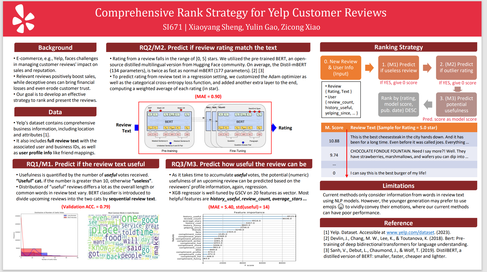

# NLP-Ranking-of-Yelp-Customer-Reviews
Project of Umich SI 671: Data Mining: Methods and Applications

Group member: Xiaoyang Sheng, Yulin Gao, Zicong Xiao

# Data source:
All the json files used in the code are downloaded on https://www.yelp.com/dataset. All the csv files are generated by the program.

# File:
## Run the final ranking algorithm:
final_rank_program_1.py

final_rank_program_2.py

## Models
### NLP:
nlp_review_helpful_train.py

nlp_review_helpful_predict.py

nlp_review_rate_train.py

nlp_review_rate_predict.py
### XGB regressor:
regression.ipynb

### EDA and draft:
nlp.ipynb

### processing data:
read_data_v2.py

# Results:
You can find detailed results in the report, SI_671_Project_Report.pdf, and the NLP model is trained and run on an NVIDIA
GeForce RTX 4050 Laptop GPU.
